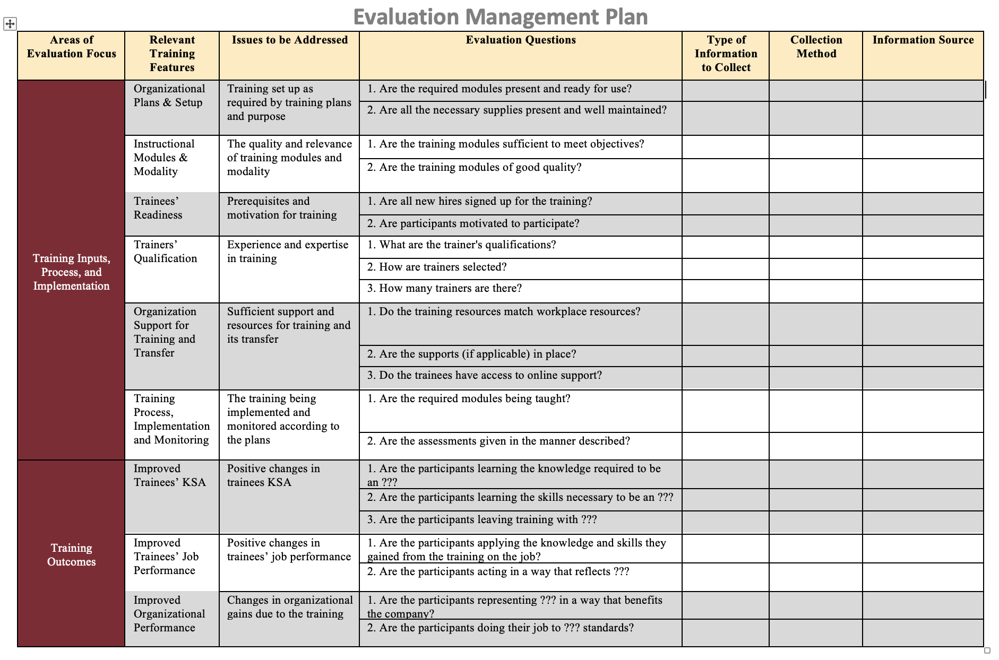

```{r setup, include=FALSE}
usethis::use_git_ignore(c("*.csv", "*.rds"))
options(htmltools.dir.version = FALSE)

library(knitr)
library(tidyverse)
library(xaringan)
library(fontawesome)
```

class: inverse, center, middle


# `r fa("far fa-images", fill = "#fff")`

**View the slides:** 

[bretsw.github.io/eme6357-module4](https://bretsw.github.io/eme6357-module4)

---

class: inverse, center, middle

# `r fa("far fa-edit", fill = "#fff")` <br> Evaluation Plan <br> Part 4

---

# Evaluation Management Plan

```{r, out.width = "720px", echo = FALSE, fig.align = "center"}

```

--

- Creating a guide for developing methodology and data collection

---

# `r fa("fas fa-tasks", fill = "#fff")` Rubric

```{r, out.width = "480px", echo = FALSE, fig.align = "center"}

```

- Format, Grammar, and Style (10 points)
- Introduction (15 points)
- Evaluation Management Plan (25 points)
- Justification of Evaluation Questions (40 points)
- Evaluation Design Measures and Instruments (70 points)
- Evaluation Communication Plan (25 points)
- Conclusion (15 points)
- Group Participation and Contribution (100 points)

---

# Management Plan Table

```{r, out.width = "100%", echo = FALSE, fig.align = "center"}

```

---

# Communication Plan

```{r, out.width = "100%", echo = FALSE, fig.align = "center"}

```

---

# Group Contribution

### Score your fellow group members and yourself

[Qualtrics Survey](https://fsu.qualtrics.com/jfe/form/SV_3pI5Umch9ZOYC8K)

```{r, out.width = "100%", echo = FALSE, fig.align = "center"}

```

---

class: inverse, center, middle

# `r fa("fas fa-book-open", fill = "#fff")` <br> Module 4 readings

---

# Chelimsky (2008)

```{r, out.width = "480px", echo = FALSE, fig.align = "center"}

```

### Tensions

--

"Clashes" between:

--

- Evaluative Independence

--

- Political Requirements

---

# Chelimsky (2008)

```{r, out.width = "480px", echo = FALSE, fig.align = "center"}
include_graphics("img/self-directed.jpg")
```

### Suggestions

--

1. Expand the Design Phase

--

2. Include Public Groups in Evaluations, When Relevant

--

3. Lean Heavily on Negotiation

--

`r fa("far fa-lightbulb", fill = "#782F40")` **Key idea:** Work with your stakeholders

---

# Hurteau et al. (2009)

```{r, out.width = "480px", echo = FALSE, fig.align = "center"}
include_graphics("img/measure.jpg")
```

### Credibility of evaluation

--

`r fa("far fa-lightbulb", fill = "#782F40")` **Key idea:** Purpose of evaluation is to make **judgments**

--

These judgments must be:

--

- Legitimate

--

- Justified

---

# Hurteau et al. (2009)

```{r, out.width = "480px", echo = FALSE, fig.align = "center"}
include_graphics("img/measure.jpg")
```

### Legitimate Judgment

--

- the judgment refers to the evaluation questions/goals

--

- the judgment is supported by criteria

--

- the judgment is supported by a standard

---

# Hurteau et al. (2009)

```{r, out.width = "100%", echo = FALSE, fig.align = "center"}

```

### Justified Judgment

--

- justification of the criteria (i.e. warrants, backings)

--

- justification of the standards (i.e. qualifiers)

--

- documentation of the procedure used to synthesize the information into a judgment

---

# Picciotto (2011)

```{r, out.width = "420px", echo = FALSE, fig.align = "center"}
include_graphics("img/survey.jpg")
```

### Is evaluation a profession?

--

- Prestige and status

--

- Ethical dispositions

--

- Expertise

--

- Autonomy

--

- Credentials

---

class: inverse, center, middle

# `r fa("fas fa-binoculars", fill = "#fff")` <br> Looking Beyond the Course

---

# Melissa's Reflections

```{r, out.width = "600px", echo = FALSE, fig.align = "center"}
include_graphics("img/future-research.jpg")
```

- Evaluation Principles

- Evaluation Models

- Case Studies

---


class: inverse, center, middle

# Your Reflections

<div class="padlet-embed" style="border:1px solid rgba(0,0,0,0.1);border-radius:2px;box-sizing:border-box;overflow:hidden;position:relative;width:100%;background:#F4F4F4"><p style="padding:0;margin:0"><iframe src="https://fsu.padlet.org/embed/51jrfivtib4k6cvw" frameborder="0" allow="camera;microphone;geolocation" style="width:100%;height:480px;display:block;padding:0;margin:0"></iframe></p><div style="padding:8px;text-align:right;margin:0;"><a href="https://padlet.com?ref=embed" style="padding:0;margin:0;border:none;display:block;line-height:1;height:16px" target="_blank"></a></div></div>

---

class: inverse, center, middle

# Questions?

```{r, out.width = "480px", echo = FALSE, fig.align = "center"}
include_graphics("img/question.jpg")
```

**What questions can I answer for you now?**

**How can I support you this week?**

<hr>

`r fa("envelope", fill = "white")` [bret.staudtwillet@fsu.edu](mailto:bret.staudtwillet@fsu.edu) | `r fa("twitter", fill = "white")` [@bretsw](https://twitter.com/bretsw) | `r fa("globe", fill = "white")` [bretsw.com](http://bretsw.com)